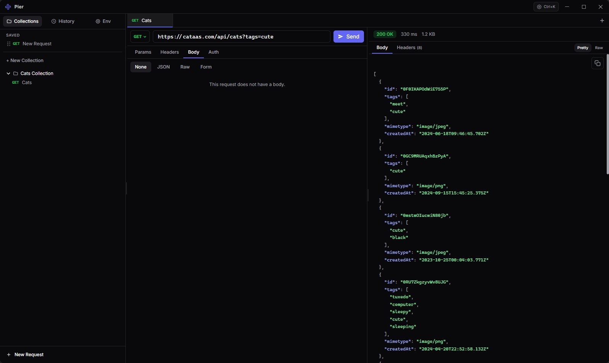

<p align="center">
  
</p>

<h1 align="center">Pier</h1>

<p align="center">
  <strong>Local-first REST API desktop client</strong><br />
  Windows · macOS · Linux · <a href="https://tauri.app/">Tauri v2</a> · <a href="https://www.solidjs.com/">SolidJS</a>
</p>

A **local-first**, **privacy-first** REST client. No account — collections, environments, and history stay on your machine as JSON files.

## Screenshot

<p align="center">
  
</p>

## Features

- **HTTP requests** — Methods, URL, query params, headers, body (JSON, raw, form-data)
- **Auth** — None, Bearer, Basic, API Key (header or query)
- **Response** — Pretty JSON with syntax highlighting, raw body, headers; status, timing, size; copy body (pretty or raw)
- **Tabs** — Multiple requests at once; inline rename; new tabs become saved standalone requests automatically
- **Collections** — Folders and requests; context menu; drag standalone requests into collections
- **Environments** — Variables with `{{name}}` interpolation on URL, headers, body, and auth
- **History** — Recent requests with quick re-open
- **Command palette** — `Ctrl+K` for actions and navigation
- **Themes** — Dark, light, or follow the system

## Tech stack

| Layer | Stack |
|--------|--------|
| Shell | Tauri v2, Rust |
| UI | SolidJS, TypeScript, Tailwind CSS v4 |
| HTTP | reqwest (Rust; no browser CORS) |
| Data | JSON files in the app data directory |
| Tooling | Bun, Vite |

## Prerequisites

- [Rust](https://www.rust-lang.org/tools/install) (stable)
- [Bun](https://bun.sh/)
- [Tauri prerequisites](https://v2.tauri.app/start/prerequisites/) for your OS

## Download (Windows x64)

Prebuilt installers are attached to [GitHub Releases](https://github.com/asimkaya/pier-rest-client/releases) when you publish a version tag (`v0.1.0`, etc.). The NSIS `.exe` registers an uninstaller in **Settings → Apps** (or **Control Panel → Programs**).

Without [code signing](https://v2.tauri.app/distribute/sign/windows/), SmartScreen may warn on first download; users can still run the app after “More info” → “Run anyway”.

**Try the CI build without a release:** in GitHub, open **Actions → Windows x64 (NSIS) → Run workflow**, then download **Pier-Windows-x64-setup** from the run’s Artifacts.

## Getting started

```bash
git clone https://github.com/asimkaya/pier-rest-client
cd pier-rest-client

bun install
bun run tauri dev
```

**Production build**

```bash
bun run tauri build
```

**Other scripts**

```bash
./node_modules/.bin/tsc --noEmit   # typecheck
bun run lint
bun run format
```

## Documentation

- [`DEVELOPMENT.md`](DEVELOPMENT.md) — architecture, data layout, UI patterns (modals, tabs, stores), and conventions for contributors

## Contributing

Issues and pull requests are welcome. For larger changes, skim `DEVELOPMENT.md` first so patches match existing patterns (Solid stores, Tauri commands, modal UX).

## Privacy

No cloud sync, no telemetry, no sign-in. Credentials and collections live only in your local app data folder.

## License

[MIT](LICENSE)
